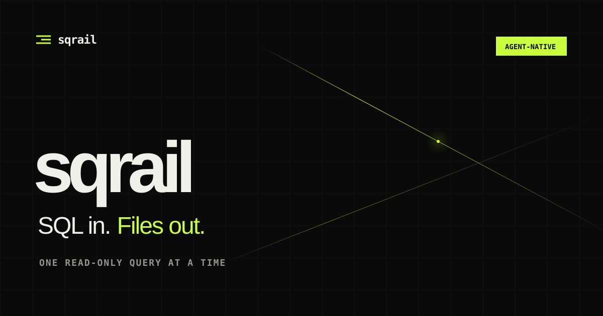

<div align="center">
  <a href="https://sqrails.yhay81.com">
    
  </a>

  <p>
    <strong>One bounded, read-only SQL query over local files.</strong><br>
    A small CLI for coding agents that already know the SQL.
  </p>

  <p>
    <a href="https://github.com/yhay81/sqrail/actions/workflows/ci.yml"></a>
    <a href="https://github.com/yhay81/sqrail/releases/latest"></a>
    <a href="https://github.com/yhay81/sqrail/blob/main/LICENSE"></a>
    <a href="https://github.com/yhay81/sqrail"></a>
  </p>

  <p>
    <a href="https://sqrails.yhay81.com">Website</a>
    ·
    <a href="https://sqrails.yhay81.com/docs/">3-minute guide</a>
    ·
    <a href="docs/CONTRACT.md">Contract</a>
    ·
    <a href="docs/BENCHMARKS.md">Benchmarks</a>
    ·
    <a href="SECURITY.md">Security</a>
    ·
    <a href="CONTRIBUTING.md">Contributing</a>
  </p>
</div>

---

sqrail is not a natural-language interface, an agent framework, or a new query
engine. The model writes SQL. sqrail embeds DuckDB and supplies the missing
execution boundary: canonical file binding, streamed results, explicit resource
limits, atomic output, and machine-readable diagnostics.

```sh
sqrail run \
  -t sales=sales.csv \
  -t drugs=drugs.parquet \
  -o result.parquet \
  - <<'SQL'
SELECT d.name, sum(s.amount) AS total
FROM sales s
JOIN drugs d USING (drug_id)
GROUP BY d.name
ORDER BY total DESC
SQL
```

## Why sqrail

| Need                              | sqrail's answer                                                   |
| --------------------------------- | ----------------------------------------------------------------- |
| A model already writes SQL        | Keep SQL as the only query language                               |
| Tool instructions consume context | Learn the complete interface with `sqrail --help`                 |
| File access should be intentional | Allowlist only explicitly bound inputs                            |
| Agent work must be bounded        | Cap memory, threads, time, spill, rows, bytes, files, and SQL     |
| Pipelines need stable I/O         | Stream JSONL; emit one JSON diagnostic; use documented exit codes |
| Failed output must be harmless    | Write privately, commit atomically, never overwrite               |

The interface has three verbs: `schema` when names and types are unknown,
`check` to plan without execution, and `run` to execute once. See the
[3-minute guide](https://sqrails.yhay81.com/docs/) or give an agent the canonical
[195-word help](https://sqrails.yhay81.com/help.txt).

## Install

```sh
brew install yhay81/tap/sqrail
```

The v0.3 release workflow produces prebuilt archives for Linux, macOS, and
Windows on x86-64 and Arm64 for the
[Releases](https://github.com/yhay81/sqrail/releases) page. Each v0.3 release includes
`SHA256SUMS`, an SPDX SBOM, and GitHub build-provenance and SBOM attestations.

Extract the archive and place `bin/sqrail` on `PATH`. No language runtime,
package manager, daemon, or database server is required. Linux archives target
glibc 2.35 or newer and statically include the C++ runtime. Windows archives
statically include the MSVC runtime and require a UTF-8-capable Windows 10/11 or
Windows Server release. The tested platform tiers are documented in
[Platform support](docs/PLATFORMS.md).

### Install the Agent Skill

The CLI works by itself. Its optional public
[Agent Skill](skills/sqrail/SKILL.md) lets compatible agents discover when to
use it without adding the full tool manual to every prompt. With GitHub CLI
2.90 or newer:

```sh
gh skill preview yhay81/sqrail sqrail
gh skill install yhay81/sqrail sqrail --agent codex --scope user
```

Replace `codex` with the current host, including `claude-code`, `cursor`,
`github-copilot`, `opencode`, `cline`, `kiro-cli`, or `windsurf`. Google's
current consumer route is AGY/Antigravity CLI, which uses the repository's
native plugin:

```sh
agy plugin install https://github.com/yhay81/sqrail
```

The stable
[AI installer](https://sqrails.yhay81.com/install-agent.md) gives an agent a
review-first path to install both the executable and Skill, with an `npx
skills` fallback when GitHub CLI is unavailable.

## Contract

```text
sqrail schema [--memory SIZE] [--threads N] [--timeout DURATION]
              [--max-input-files N] [--strict-schema] FILE...
sqrail check [-t NAME=PATH]... [--memory SIZE] [--threads N]
             [--timeout DURATION] [--max-rows N] [--max-input-files N]
             [--max-sql-bytes SIZE] [--strict-schema] [SQL|-]
sqrail run [-t NAME=PATH]... [-o FILE] [--memory SIZE] [--threads N]
           [--spill DIR [--max-spill SIZE]] [--timeout DURATION]
           [--max-rows N] [--max-output-bytes SIZE] [--max-input-files N]
           [--max-sql-bytes SIZE] [--stats] [--strict-schema] [SQL|-]
```

- `schema` returns one JSON object per input path.
- `check` validates SQL and returns its JSON physical plan without execution.
- `-t NAME=PATH` binds a file, glob, or partitioned Parquet directory.
- Multi-file inputs union evolving columns by name; `--strict-schema` requires
  identical names, order, and types.
- `-` reads SQL from stdin and avoids shell-quoting large queries.
- SQL must parse as exactly one `SELECT`, `VALUES`, or `WITH` query.
- Without `-o`, rows are streamed as JSONL to stdout.
- With `-o`, the format follows the output extension.
- Existing outputs are never overwritten, and failed queries do not leave a
  partial destination file.
- `--max-rows` fails when the final result exceeds a declared row count.
- `--max-output-bytes`, `--max-input-files`, and `--max-sql-bytes` bound the
  other attacker- or agent-controlled dimensions.
- `--stats` emits machine-readable success metrics on stderr.
- Diagnostics are a single JSON object on stderr.
- Row order is undefined unless the SQL contains `ORDER BY`.
- No configuration file is read.
- No model or network service is embedded.

The normative details, JSON schemas, failure semantics, and exit codes are in
[CLI contract](docs/CONTRACT.md).

An agent can learn the complete interface with:

```sh
sqrail --help
```

On macOS and Linux, the installed command reference is also available through
the system manual:

```sh
man sqrail
```

The 195-word v0.3 help includes a one-action decision rule and explicit stop
condition. The low-cost-model experiments that motivated that rule are recorded
in the [agent experiment log](benchmarks/agent-eval/EXPERIMENTS.md). Integration
patterns are collected in [Agent integration](docs/AGENT_INTEGRATION.md).

## Supported files

| Input                                        | Output                                       |
| -------------------------------------------- | -------------------------------------------- |
| CSV, `.csv.gz`, `.csv.zst`                   | CSV, `.csv.gz`, `.csv.zst`                   |
| TSV, `.tsv.gz`, `.tsv.zst`                   | TSV, `.tsv.gz`, `.tsv.zst`                   |
| JSON, JSONL, NDJSON, optionally `.gz`/`.zst` | JSON, JSONL, NDJSON, optionally `.gz`/`.zst` |
| Parquet file, glob, or partitioned directory | Parquet                                      |

Externally compressed Parquet and bzip2/xz streams are deliberately rejected.

## Build

Requirements:

- CMake 3.25+
- Ninja
- a C++20 compiler
- Git and network access for the first `BUNDLED` or native-test configure, or an
  installed DuckDB CMake package for a production-only `SYSTEM` build

The native C++ unit suite does not require Python:

```sh
cmake --workflow --preset core
```

The default `BUNDLED` provider fetches DuckDB v1.5.5 at an immutable commit
during the first configure and statically links it. Native tests similarly
fetch Catch2 v3.15.3 at an immutable commit, but it is never linked into the
sqrail binary. This is the provider used for official sqrail releases:

```sh
cmake --workflow --preset dev
cmake --workflow --preset release
```

The repository development presets enable the complete Python integration,
agent-evaluation, and release-tool suites in addition to the native tests.
Python 3 is required for those full workflows, not for a production-only build
or the `core` workflow. See the [testing architecture](docs/TESTING.md).

Distribution packages can build entirely from the release source archive and
link an installed DuckDB package instead. The package must export DuckDB's CMake
configuration with the `core_functions`, `parquet`, and `json` extensions:

```sh
CMAKE_PREFIX_PATH=/path/to/duckdb cmake --workflow --preset system
cmake --install out/build/system --prefix out/install/system --component sqrail
```

`CMAKE_PREFIX_PATH` may be set to the DuckDB package prefix when it is outside
the platform's default search path. The system provider links DuckDB's shared
library, reports its actual runtime version, and does not install a second copy
of DuckDB's bundled licences.

The repository also supplies `core`, `strict`, `sanitize`, `thread`, `fuzz`,
`native`, `pgo-generate`, and `pgo-use` presets. The pinned Ubuntu 24.04/LLVM 18
development container runs the developer workflow on creation. Then:

```sh
./out/build/release/sqrail schema data.csv
./out/build/release/sqrail run -t data=data.csv 'SELECT count(*) AS rows FROM data'
```

The complete pre-tag criteria are in the
[v0.3 release gate](docs/V0.3_RELEASE.md).

## Resource controls

```sh
sqrail run \
  --memory 1GB \
  --threads 2 \
  --spill /fast-nvme/sqrail-spill \
  --max-spill 100GB \
  --timeout 10m \
  --max-rows 1000000 \
  --max-output-bytes 4GiB \
  --max-input-files 10000 \
  --max-sql-bytes 1MiB \
  --stats \
  -t data='warehouse/**/*.parquet' \
  -o result.parquet \
  - < query.sql
```

`--memory` configures DuckDB's memory limit. It is not an operating-system hard
RSS limit. sqrail disables insertion-order preservation by default so unordered
file transformations can use less memory. A unique, owner-only workspace is
created beneath `--spill` for each process and removed after the database
closes; sibling files are never exposed to SQL. `--max-spill` caps temporary
storage, and `--timeout` sets an absolute command deadline. `--max-rows`
detects an oversized final result after at most one extra
row and prevents a file destination from being committed. `--stats` reports
rows, bytes, elapsed milliseconds, resolved input-file count, and destination
on stderr after success. Deadlines begin before input expansion and cover
recursive discovery, schema inference, planning, execution, and
output finalization. The remaining caps fail with structured diagnostics and
remove private file outputs.

## Safety boundary

sqrail rejects write statements, disables DuckDB external access and extension
loading, locks the configuration, and allowlists only bound inputs, the private
output temporary path, and the private workspace created beneath an explicit
spill root. This blocks SQL from reading arbitrary local paths, including
existing siblings under the spill root. It is still process-level defense in
depth, not an operating-system sandbox; use an OS sandbox for hostile SQL or
malformed data.

## Performance

The committed harness builds sqrail and the DuckDB CLI from the same source
revision, checks logical output equivalence, and records time and peak RSS. See
[Benchmark policy](docs/BENCHMARKS.md), [harness](benchmarks/README.md), and the
[measured baseline](docs/BASELINE.md).

The objective is DuckDB-class execution without a second runtime and with a
smaller, deterministic agent-facing contract—not a claim that the embedded
DuckDB engine is faster than itself.

## Community

Questions, careful bug reports, reproducible performance evidence, documentation
improvements, and focused patches are welcome. Ask in
[Discussions](https://github.com/yhay81/sqrail/discussions), browse the
[`good first issue`](https://github.com/yhay81/sqrail/labels/good%20first%20issue)
queue, or start with the [support guide](SUPPORT.md) and
[contribution guide](CONTRIBUTING.md). Everyone participating in the project
must follow the [Code of Conduct](CODE_OF_CONDUCT.md). Report suspected
vulnerabilities privately through the [security policy](SECURITY.md).

The [documentation index](docs/README.md) maps each question to its normative
source. Please treat benchmark numbers as hardware-specific observations unless
the linked harness and equivalent-work checks support a broader claim.

The public [community growth plan](docs/COMMUNITY_GROWTH.md) records who sqrail
is for, how the project will earn attention, and which outcomes it measures.

## License

MIT. Official release binaries statically link DuckDB; distribution packages
may link a packaged DuckDB shared library. See
[Third-party notices](THIRD_PARTY_NOTICES.md).
